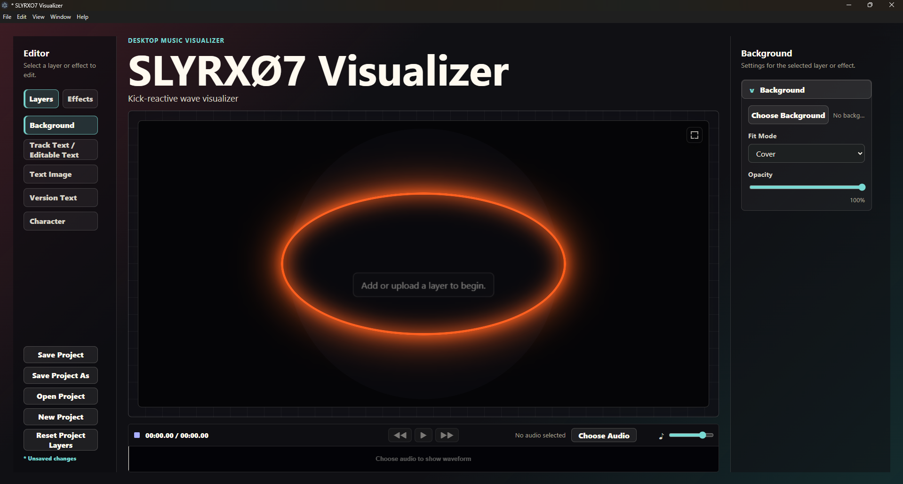
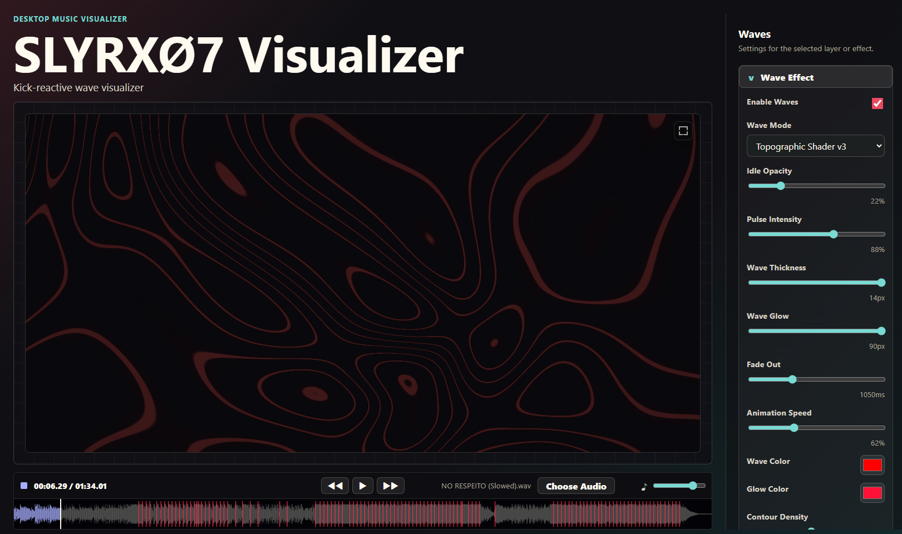

This is a public showcase repository. The full source code is private because the project is actively developed as a personal software product.


# SLYRX07 Visualizer

**SLYRX07 Visualizer** is a desktop music visualizer and audio-reactive visual editor for creating layered music visuals, short-form music content, and export-focused visualizer scenes.

> **Public Showcase Repository**  
> This repository is a public showcase for recruiters, internship applications, and Werkstudent opportunities.  
> The full source code is private because the project is actively developed as a personal software product. This repository is not intended to be an open-source or runnable distribution.

---

## Overview

SLYRX07 Visualizer is a desktop application designed for creators who want to build music visualizer scenes with editable backgrounds, text, character/image layers, audio-reactive effects, and timeline-based preview behavior.

The project combines frontend UI engineering, desktop application development, audio analysis, animation systems, and export-oriented rendering workflows.

---

## Screenshots

### Main Editor



### Layer Controls


### Waveform Timeline



---

## Demo

A short demo video can be added here:

[Demo Video](assets/demo.mp4)

---

## Key Features

- Desktop application interface
- Layer-based visual editor
- Left sidebar with separate **Layers** and **Effects** workflows
- Right-side settings panel for the selected layer or effect
- Editable visual layers, including:
  - Background
  - Track Text / Editable Text
  - Text Image
  - Version Text
  - Character / Image layer
- Custom layer controls such as:
  - Position
  - Scale
  - Opacity
  - Font size
  - Stroke width
  - Glow intensity
  - Kick pulse amount
  - Letter spacing
  - Rotation
  - Fill color
  - Stroke color
  - Glow color
- Audio waveform timeline
- Playback controls
- Local audio file selection workflow
- Project save/load system
- Kick/bass-reactive visual behavior
- Preview-focused scene composition
- Export-oriented rendering workflow for music visualizer videos

---

## Tech Stack

Built with a desktop web technology stack including:

- **React**
- **TypeScript**
- **Electron**
- **Canvas / WebGL**
- **Audio analysis**
- **Local project file management**
- **Custom UI state management**

---

## High-Level Architecture

The application is structured around a visual editor model:

```text
Audio Input
   ↓
Audio Analysis / Kick Marker Data
   ↓
Timeline + Playback State
   ↓
Layer & Effect Settings
   ↓
Visualizer Stage Preview
   ↓
Export-Oriented Rendering Pipeline
